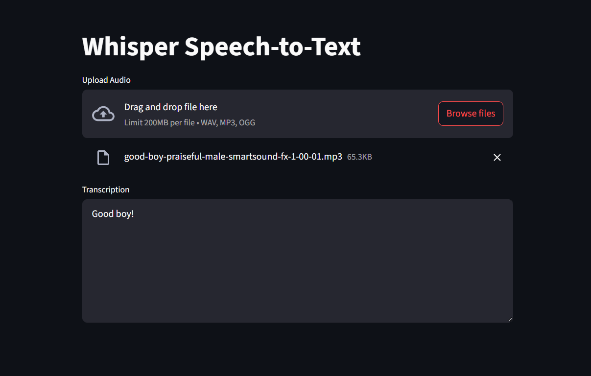

# 🎙️ Custom STT Pipeline with Fine-Tuning Support

## 📌 Model:
**Whisper Tiny** (`openai/whisper-tiny`)

## 📚 Fine-tuning Dataset:
Hugging Face Common Voice (100 samples demo)

---

## 🚀 How to Use:

### 1️⃣ Clone the Repository
```
git clone https://github.com/HelithaNimnaka/Custom-STT-Pipeline-with-Fine-Tuning-Support.git
cd Custom-STT-Pipeline-with-Fine-Tuning-Support
```
### 2️⃣ Install Requirements
```
pip install -r requirements.txt
```
### 3️⃣ Run the App
```
python app.py
```
👉 You will see an interface like this:  



---

## 🛠 Fine-Tuning Steps:

1. **Add Hugging Face Token:**  
   In `finetuning.py`:
   ```python
   token = "add_your_huggingface_token_here"
2. **Run Fine-Tuning Script:**<br>
   Customize the dataset/model if needed and run:
   ```
   python finetuning.py
   ```
3. **Update Weights:**<br>
   Load the fine-tuned model weights into `stt_pipeline.py` for inference.
   
---

### ✅ Done! You now have a fully functional Speech-to-Text pipeline with fine-tuning support.
